# tietokannat_K2025
Kesä 2025 Tietokannat ja rajapinnat kurssin harjoitustyö.

Työn suoritti: Jussi Mitteli

Harjoituksen tavoitteena oli rakentaa tietokantayhteys MySQL-opintorekisteri -tietokantaan Node.js- ja Express-teknologioita käyttäen. Testasin toiminnot käyttäen Postman ohjelmaa. MySQL palvelimena käytin Uniserveriä joka oli kurssin materiaaleissa myös käytössä. Tässä harjoituksen ohjelmoinnissa ja dokumentaatiossa käytin kielenä suomea koska se on helpompi oppimiseen ja asioiden sisäistämiseen. Oikeassa projektissa käyttäisin kuitenkin englannin kieltä, joka on kansainvälisesti parempi kieli ja ammattimaisempi.

Opin tämän harjoituksen myötä paljon ja työtä tehdessä tuli paljon ideoita miten jatkossa rakentaisin vastaavan ohjelmiston. Haluaisin vielä lisätä muutamia automaattisia toimintoja ohjelmistoon joilla voidaan suodattaa dataa paremmin ja tietokannan käytettävyys paranisi huomattavasti. Haluaisin lisätä tähän vielä enemmän yksittäisten taulujen datan yhdistelemistä, mutta aika loppui kesken ja en ehtinyt lisätä kaikkea mitä olisin halunnut. Tämän hetkisessä versiossa on mahdollista hakea kaikkien opiskelijoiden yhteenveto käyttäen Stored Proceduresia SQL palvelimella, mutta haluan vielä lisätä siihen lisää toimintoja yksittäisten opiskelijoiden tietojen hallintaan ja keräykseen.

Arvioinnit tauluun olisi vielä hyvä lisätä päivämäärä kun opiskelija on lisätty kurssille arvosanan anto päivämäärän lisäksi.

Suurimmassa osassa toimintoja tietojen muokkaukseen ja poistamiseen käytetään kyseisten tietojen asiaankuuluvia ID numeroita, opiskelija_id, arviointi_id, opintojakso_id jne.

Tietokanta koostuu kolmesta taulusta opiskelija, arviointi ja opintojakso.

Jos kuvat eivät näy ne löytyvät kansiosta /opintorekisteri-api/kuvat

Video linkki:
https://youtu.be/O9SHEtMHnk4

## Tietokantakaavio

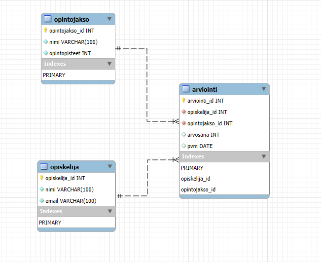


```
+---------------------------+
| Tables_in_opintorekisteri |
+---------------------------+
| arviointi                 |
| opintojakso               |
| opiskelija                |
+---------------------------+

```


Opiskelija-taulun rakenne:
```
+---------------+--------------+------+-----+---------+----------------+
| Field         | Type         | Null | Key | Default | Extra          |
+---------------+--------------+------+-----+---------+----------------+
| opiskelija_id | int          | NO   | PRI | NULL    | auto_increment |
| nimi          | varchar(100) | NO   |     | NULL    |                |
| email         | varchar(100) | NO   |     | NULL    |                |
+---------------+--------------+------+-----+---------+----------------+

```
Opintojakso-taulun rakenne:

```
+----------------+--------------+------+-----+---------+----------------+
| Field          | Type         | Null | Key | Default | Extra          |
+----------------+--------------+------+-----+---------+----------------+
| opintojakso_id | int          | NO   | PRI | NULL    | auto_increment |
| nimi           | varchar(100) | NO   |     | NULL    |                |
| opintopisteet  | int          | NO   |     | NULL    |                |
+----------------+--------------+------+-----+---------+----------------+

```
Arviointi-taulun rakenne:

```
+----------------+------+------+-----+---------+----------------+
| Field          | Type | Null | Key | Default | Extra          |
+----------------+------+------+-----+---------+----------------+
| arviointi_id   | int  | NO   | PRI | NULL    | auto_increment |
| opiskelija_id  | int  | NO   | MUL | NULL    |                |
| opintojakso_id | int  | NO   | MUL | NULL    |                |
| arvosana       | int  | YES  |     | NULL    |                |
| pvm            | date | YES  |     | NULL    |                |
+----------------+------+------+-----+---------+----------------+

```
Opiskelijat ja opintojaksot yhdistetään toisiinsa arviointi taulun kautta käyttäen opiskelija_id ja opintojakso_id tietueita. Taulujen tietoja voidaan lukea, lisätä, päivittää ja poistaa (CRUD) http rajapinnan kautta esimerkiksi postmanilla tai suoraan selaimesta.

# Ohjelmiston toiminta on seuraavanlainen:

Selain/testiohjelma lähettää pyynnön GET/POST/PUT/DELETE Express serverille joka käsittelee pyynnön, lähettää sen Routesissa määritellylle toiminnolle(controller) joka sitten suorittaa toiminnolle modelissa määritettyjä SQL-kielen komentoja mySQL palvelimen konsolissa. Ohjelma palauttaa onnistuneen pyynnön käsittelyn seurauksena pyydetyt tiedot, poistaa tiedot, päivittää tiedot tai lisää uusia tietoja. Stored Procedure toimintojen avulla voidaan suorittaa yhteenveto esimerkiksi kaikkien tietokannassa olevien opiskelijoiden opintosuorituksista opintopisteinä ja keskiarvoista. Stored Procedures ovat toimintoja jotka on tallennettu tavallaan funktiona SQL palvelimelle ja niitä voidaan kutsua mysql konsolissa CALL funktiolla.

# Postman testikomennot

Postmanissa testi komentojen alussa on palvelimen osoite joka itselläni oli http://localhost:3000/ siitä syystä että palvelin pyörii samalla koneella josta testi komennot lähetetään ja kuuntelee porttia 3000.
Käytä osoitetta selaimessa tai Postmanissa komennon osoitteen alussa ja lisää siihen haluamasi toiminnon osoite. Esimerkiksi http://localhost:3000/opiskelijat hakee kaikkien tietokannassa olevien opiskelijoiden nimen ja sähköpostiosoitteen GET toiminnolla.

## Opiskelija (GET, POST, PUT, DELETE)

### Hae kaikki opiskelijat (GET)
GET /opiskelijat


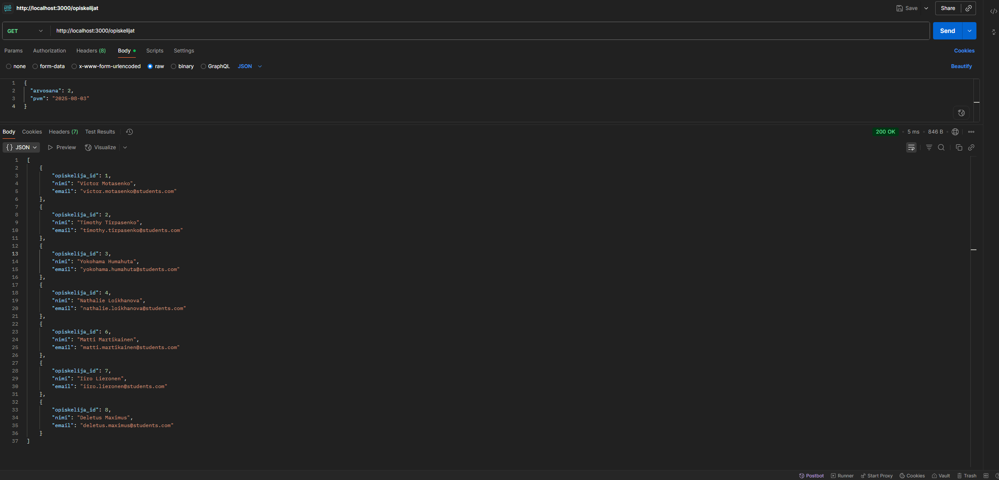


### Lisää opiskelija (POST)
POST /opiskelijat

Body (JSON):
```
{
  "nimi": "Testi Testaaja",
  "email": "testi.testaaja@students.com"
}
```


### Päivitä opiskelijan tiedot (PUT)
PUT /opiskelijat/:id

Body (JSON):
```
{
  "nimi": "Päivitetty Nimi",
  "email": "paivitetty.email@students.com"
}
```
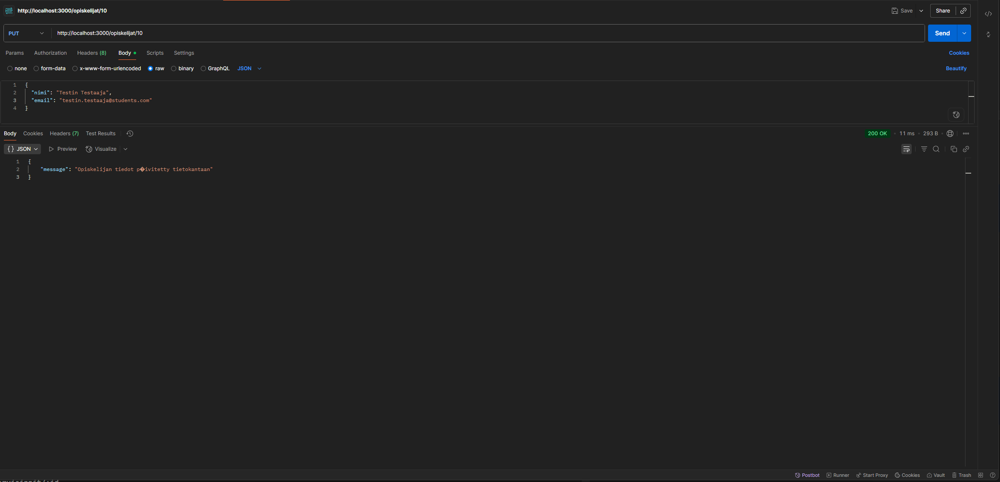


### Poista opiskelija (DELETE)
DELETE /opiskelijat/:id


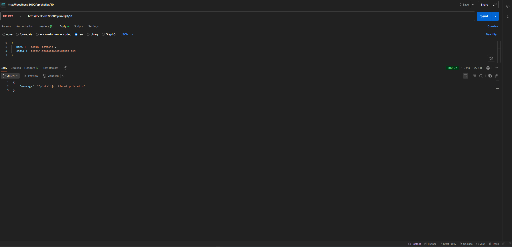


***************************************


## Opintojakso (GET, POST, PUT, DELETE)

Hae kaikki opintojaksot (GET)
GET /opintojaksot


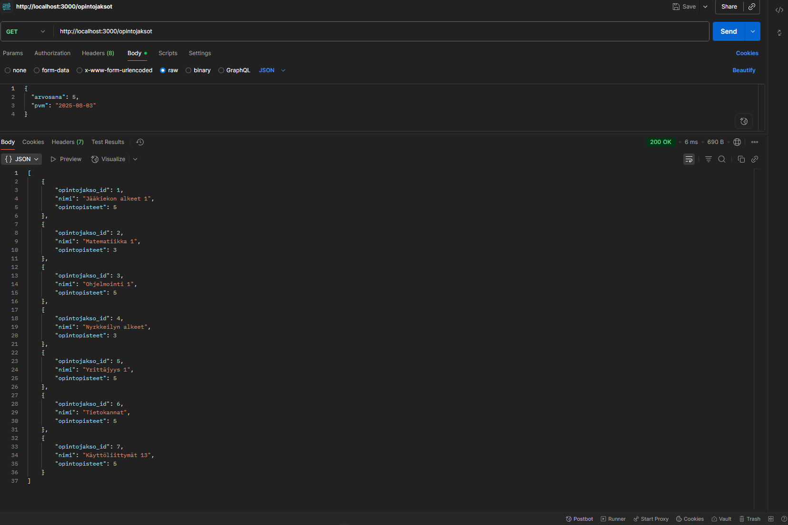


### Lisää opintojakso (POST)
POST /opintojaksot

Body (JSON):
```
{
  "nimi": "Tietokannat ja Rajapinnat",
  "opintopisteet": 5
}
```

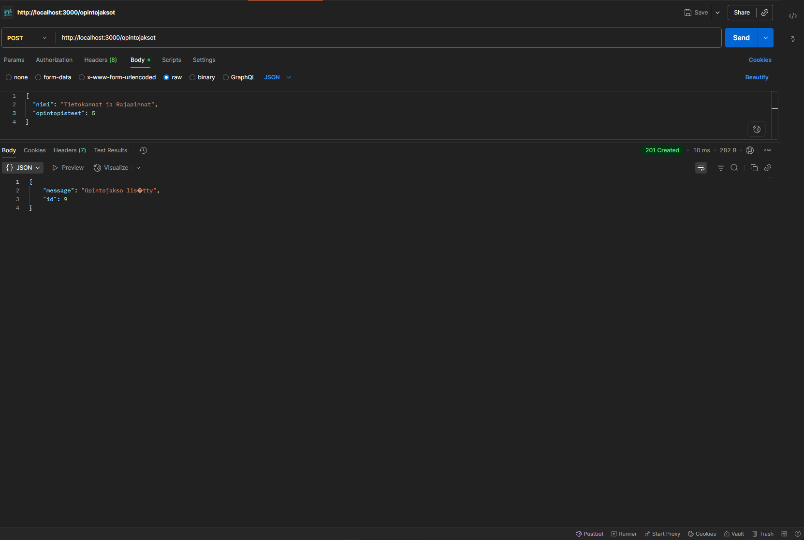


### Päivitä opintojakso (PUT)
PUT /opintojaksot/:id

Body (JSON):
```
{
  "nimi": "Päivitetty Jakso",
  "opintopisteet": 10
}
```

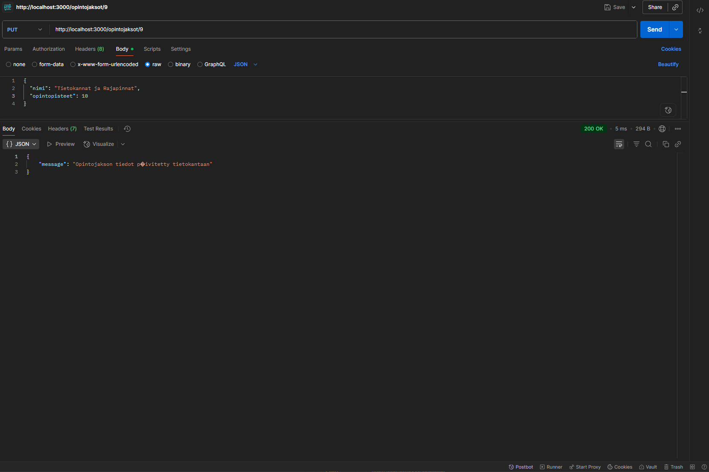


### Poista opintojakso (DELETE)
DELETE /opintojaksot/:id


**********************************


## Arviointi (GET, POST, PUT, DELETE)

### Hae kaikki arvioinnit (GET)
GET /arvioinnit


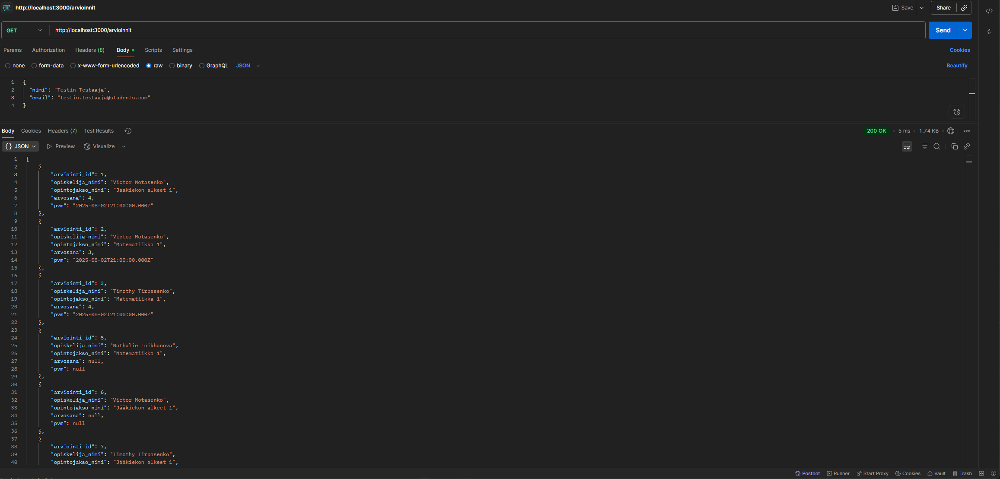


### Hae kaikki arvioinnit yksittäiselle opiskelijalle ID mukaan (GET)
arvioinnit/opiskelija/:id


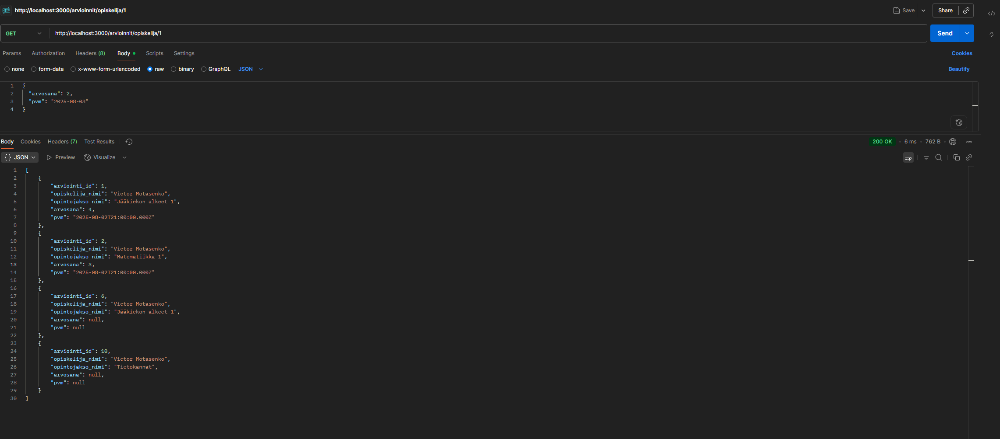


### Lisää arviointi (POST)
POST /arvioinnit

Body (JSON):
```
{
  "opiskelija_id": 1,
  "opintojakso_id": 2
}
```
Huom: Arvosana ja pvm lisätään PUT:lla myöhemmin.

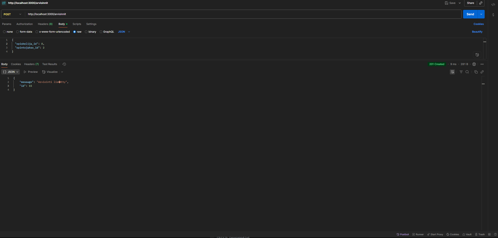

### Hae opiskelijan arvioinnit (GET)
GET /arvioinnit/opiskelija/:id

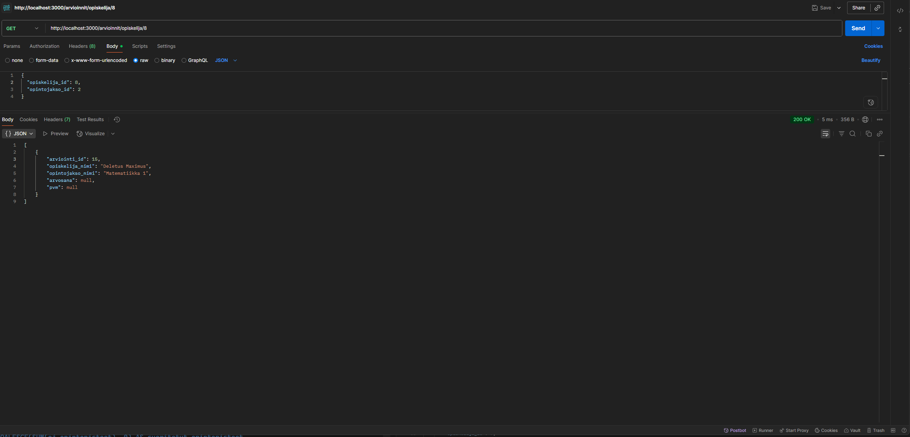

### Lisää arvosana ja päivämäärä arviointiin (PUT)
PUT /arvioinnit/:id

Body (JSON):

```
{
  "arvosana": 4,
  "pvm": "2025-08-03"
}
```

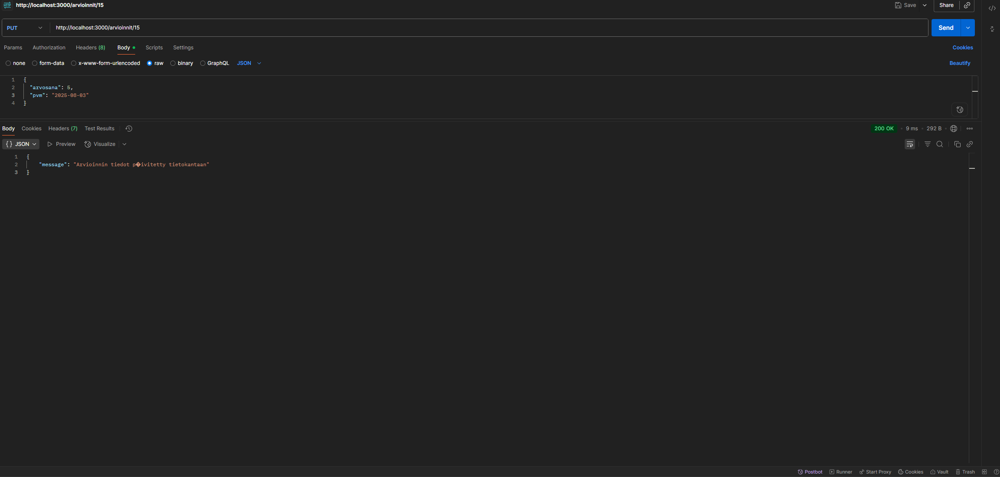


### Poista arviointi (DELETE)
DELETE /arvioinnit/:id


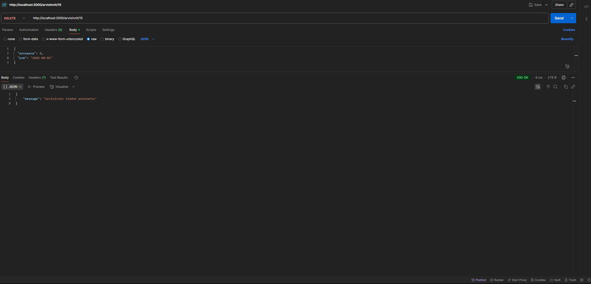


*******************************************************************************************************************************
# Stored Procedure komennot:

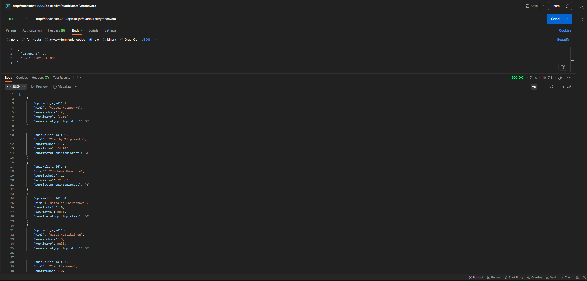

Kaikkien opiskelijoiden yhteenvedon haku tietokannasta:
```sql
CREATE PROCEDURE hae_opiskelijoiden_suoritukset()
BEGIN
    SELECT
        o.opiskelija_id,
        o.nimi,
        COUNT(a.arvosana) AS suorituksia,
        ROUND(AVG(a.arvosana), 2) AS keskiarvo,
        COALESCE(SUM(oj.opintopisteet), 0) AS suoritetut_opintopisteet
    FROM opiskelija o
    LEFT JOIN arviointi a 
        ON o.opiskelija_id = a.opiskelija_id AND a.arvosana IS NOT NULL
    LEFT JOIN opintojakso oj 
        ON a.opintojakso_id = oj.opintojakso_id
    GROUP BY o.opiskelija_id, o.nimi;
END $$
```
*******************************************************************************************************************************
